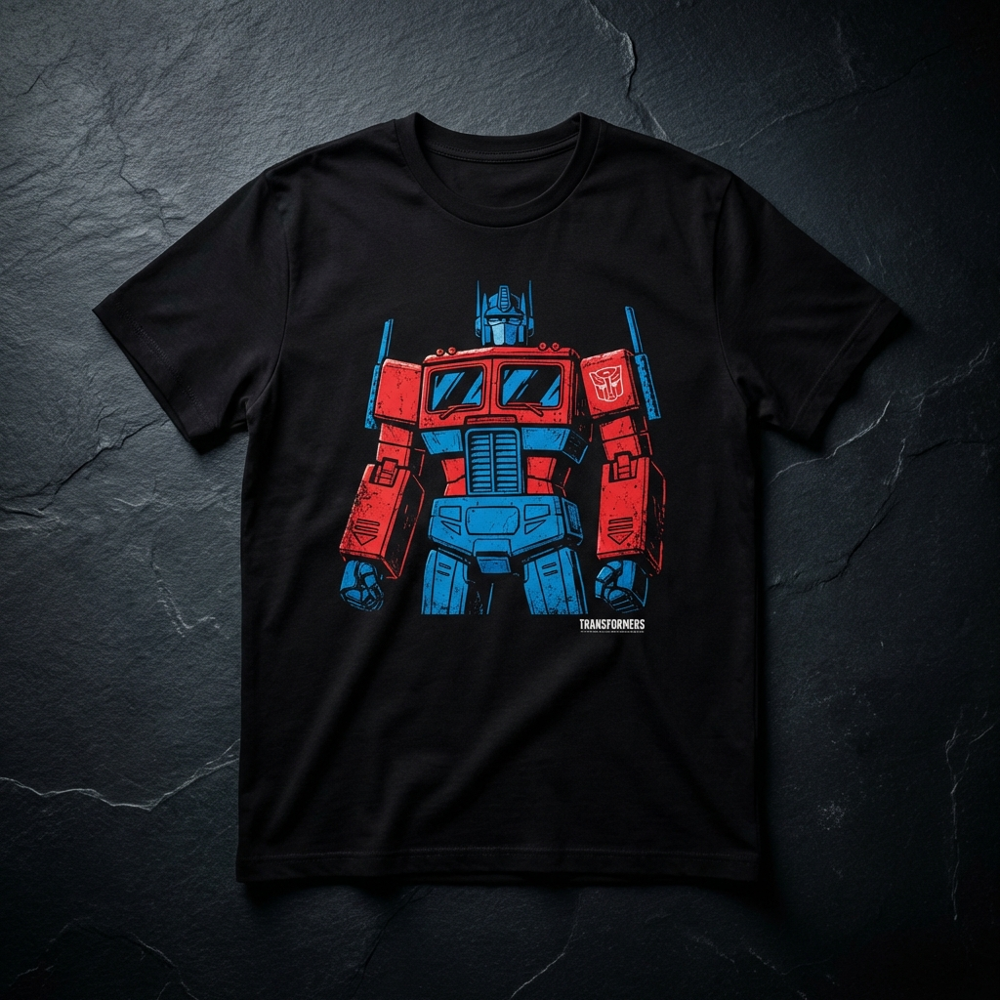

# 🔴 T-SANK — Wear the Transformation

> Premium Transformers merchandise for fans who wear their allegiance.

<p align="center">
  
</p>

---

## ✨ Overview

**T-SANK** is a cinematic e-commerce storefront built for Transformers fans. The site features a scroll-driven transformation sequence where Optimus Prime transforms from truck to robot mode as you scroll — setting the tone for a premium streetwear shopping experience.

**Owner:** Sanket Kokate

---

## 🚀 Tech Stack

| Layer | Technology |
|-------|-----------|
| **Framework** | [Next.js 16](https://nextjs.org/) (App Router) |
| **Language** | TypeScript |
| **Styling** | Tailwind CSS 4 |
| **Animations** | Framer Motion, GSAP, AOS (Animate on Scroll) |
| **3D** | React Three Fiber + Drei |
| **Smooth Scroll** | Lenis |
| **Payments** | Razorpay |
| **Auth** | NextAuth.js (Google OAuth) |
| **Runtime** | React 19 |

---

## 🎬 Key Features

- **Scroll-Driven Transformation** — 184-frame Optimus Prime truck-to-robot sequence controlled by scroll position
- **Parallax Banners** — Cinematic depth effects throughout the page
- **Product Catalog** — Filterable grid (Autobots / Decepticons / Classics) with quick-view modals
- **Cart & Checkout** — Slide-out cart drawer with Razorpay payment integration
- **Google Authentication** — Sign in with Google via NextAuth.js
- **AOS Animations** — Fade, slide, and zoom effects triggered on scroll
- **Testimonial Carousel** — Customer reviews with auto-play
- **Search Overlay** — Full-screen product search
- **Responsive Design** — Optimized for mobile, tablet, and desktop
- **Dark Cinematic Theme** — Premium aesthetic with red accent glow effects

---

## 📁 Project Structure

```
T-sank/
├── public/
│   ├── images/
│   │   ├── products/          # Product images
│   │   └── transformer-sequence/  # 184 JPG frames for scroll animation
│   └── models/                # 3D model assets
├── src/
│   ├── app/
│   │   ├── api/
│   │   │   ├── auth/          # NextAuth API route
│   │   │   └── razorpay/      # Payment order & verification endpoints
│   │   ├── globals.css        # Design system (colors, fonts, utilities)
│   │   ├── layout.tsx         # Root layout with providers
│   │   └── page.tsx           # Home page (all sections assembled)
│   ├── components/
│   │   ├── HeroSection.tsx    # Scroll-driven transformation canvas
│   │   ├── Navbar.tsx         # Sticky navigation with mobile menu
│   │   ├── ProductGrid.tsx    # Filterable product catalog
│   │   ├── CartDrawer.tsx     # Slide-out shopping cart
│   │   ├── CheckoutModal.tsx  # Razorpay checkout flow
│   │   ├── FeaturedCollection.tsx
│   │   ├── AboutSection.tsx
│   │   ├── Footer.tsx
│   │   ├── ParallaxBanner.tsx
│   │   ├── TestimonialCarousel.tsx
│   │   ├── SearchOverlay.tsx
│   │   ├── ProductQuickView.tsx
│   │   ├── FuzzyText.tsx      # Glitch text effect
│   │   ├── Lanyard/           # 3D lanyard component
│   │   ├── FlowingMenu/      # Animated menu component
│   │   ├── GooeyNav/          # Gooey navigation effect
│   │   └── ScrollFloat/       # Float-on-scroll component
│   ├── context/
│   │   ├── CartContext.tsx     # Shopping cart state management
│   │   └── ToastContext.tsx    # Toast notification system
│   └── data/
│       └── products.ts        # Product catalog & store config
├── .env.local.template        # Environment variables template
├── next.config.ts
├── tailwind.config.ts
├── tsconfig.json
└── package.json
```

---

## ⚡ Getting Started

### Prerequisites

- **Node.js** ≥ 18
- **npm** ≥ 9

### Installation

```bash
# Clone the repository
git clone https://github.com/sanketkokate712/T-SANK.git
cd T-sank

# Install dependencies
npm install

# Set up environment variables
cp .env.local.template .env.local
# Edit .env.local with your API keys
```

### Environment Variables

| Variable | Description |
|----------|-------------|
| `RAZORPAY_KEY_ID` | Razorpay API Key ID |
| `RAZORPAY_KEY_SECRET` | Razorpay API Key Secret |
| `NEXT_PUBLIC_RAZORPAY_KEY_ID` | Razorpay public key (client-side) |
| `NEXTAUTH_SECRET` | NextAuth.js session secret |
| `NEXTAUTH_URL` | App URL (default: `http://localhost:3000`) |
| `GOOGLE_CLIENT_ID` | Google OAuth Client ID |
| `GOOGLE_CLIENT_SECRET` | Google OAuth Client Secret |

### Run Development Server

```bash
npm run dev
```

Open [http://localhost:3000](http://localhost:3000) to see the store.

### Build for Production

```bash
npm run build
npm start
```

---

## 🎨 Design System

The app uses a custom dark cinematic theme defined in `globals.css`:

| Token | Value | Usage |
|-------|-------|-------|
| `--base-dark` | `#0a0a0a` | Page background |
| `--accent-red` | `#b71c1c` | Primary accent / CTAs |
| `--accent-red-bright` | `#d32f2f` | Hover states |
| `--text-primary` | `#ffffff` | Headings |
| `--text-secondary` | `#a0a0a0` | Body text |
| `--text-muted` | `#666666` | Subtle labels |
| `--neutral-carbon` | `#1a1a1a` | Cards / surfaces |

**Fonts:**
- **Heading:** Orbitron (futuristic, bold)
- **Body:** Inter (clean, readable)

---

## 📱 Responsive Breakpoints

| Breakpoint | Width | Target |
|-----------|-------|--------|
| Default | < 640px | Mobile |
| `sm` | ≥ 640px | Large phones |
| `md` | ≥ 768px | Tablets |
| `lg` | ≥ 1024px | Desktop |
| `xl` | ≥ 1280px | Large screens |

---

## 🛒 Product Categories

| Category | Description |
|----------|-------------|
| **Autobots** | Optimus Prime, Bumblebee, Autobot Insignia tees |
| **Decepticons** | Megatron, Decepticon Cyber Emblem tees |
| **Classics** | Retro '84 Squad and throwback designs |

---

## 📜 Scripts

| Command | Description |
|---------|-------------|
| `npm run dev` | Start development server |
| `npm run build` | Create production build |
| `npm start` | Start production server |
| `npm run lint` | Run ESLint |

---

## 🤝 Contributing

1. Fork the repository
2. Create a feature branch (`git checkout -b feature/awesome-feature`)
3. Commit your changes (`git commit -m 'Add awesome feature'`)
4. Push to the branch (`git push origin feature/awesome-feature`)
5. Open a Pull Request

---

## 📄 License

This project is private and proprietary. All rights reserved.

---

<p align="center">
  <strong>T-SANK</strong> — Wear the Transformation 🔴
  <br/>
  Made with ❤️ by <a href="https://github.com/sanketkokate712">Sanket Kokate</a>
</p>
